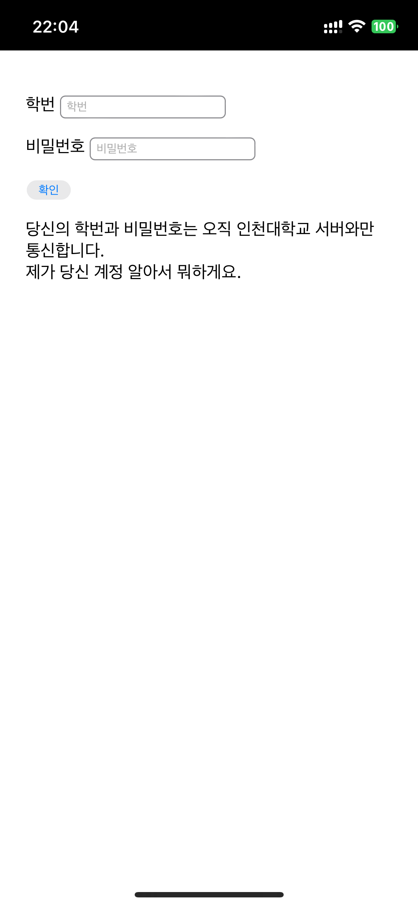
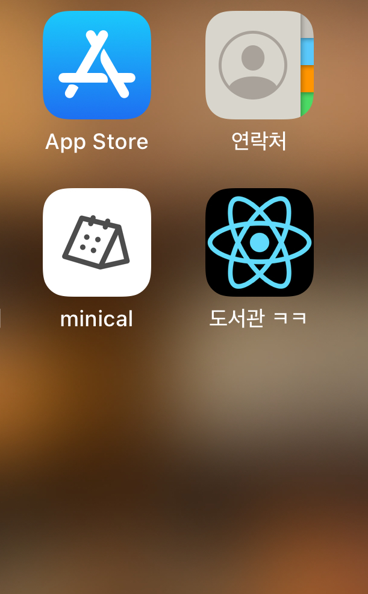

# 인천대학교 이룸관 도서관 출입증
-----
누더기같은 웹뷰로 만들어진 유사 앱이 맘에 안들어서 도서관 출입증 기능에만 집중한 웹앱을 만들게 되었어요.

### 작동 원리
인천대학교 도서관 API를 이용합니다. 생각보다 그렇게 꼬아서 개발되지 않았더라고요. 토큰 존재하면 로그인 시도를, 아니면 로그인 후 이용하게 개발했습니다.

### 해보고 싶은 것
여기서 발전시켜서 RN/Flutter에서 인앱 위젯으로 만들고 싶네요.

이제 iOS도 위젯에 버튼 만드는게 되니까 새로고침 눌러서 바코드 갱신하고.. 할 수 있는게 많을 듯 한데 전 이제 입대하니까 누가 좀 만들어주세요. App.js만 까보면 쉽게 만들 수 있어요..!

### 보안이 걱정돼요 이녀석이 내 계정 털어가면 어쩌죠
괜찮아요 그럴땐 포크떠서 본인이 서버를 여시면 됩니다! (간단하죠? 하핫) 

### 근데 진짜 좀 아쉬운거
iOS는 배포도 귀찮고,, 여러가지 이유로 인해 그냥 리액트 웹앱으로 했는데 네이티브 앱으로 개발하거나 next.js 도입해서 성능 올려보고 싶긴 하네요? 제발 아무나 좀 해주세요 복학해서 편하게 도서관좀 다닙시다 이상한앱 안키고

### 스크린샷

